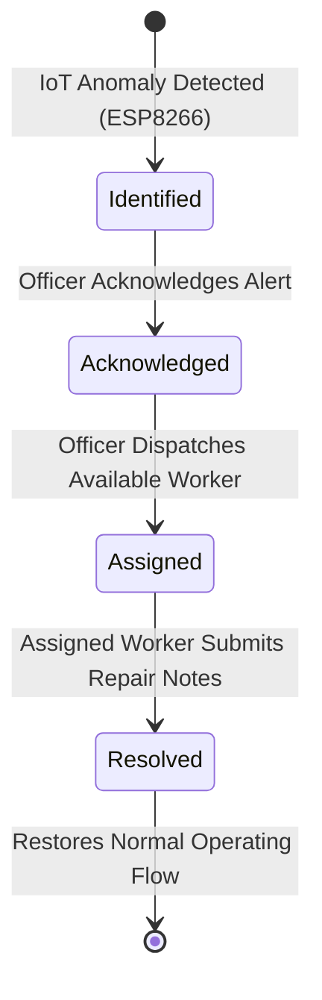

# 💧 WaterWatch — IoT Water Leakage Detection & Fault Monitoring System

**WaterWatch** is a modern, modular, production-grade Flutter mobile application built for Smart City Municipal Water Infrastructure Management. It provides distinct, role-based workflows for **Municipal Officers** and **Field Workers** to detect, acknowledge, dispatch, and resolve pipeline water leakage incidents in real time.

---

## 🚀 Key Features

### 🏢 Municipal Officer
- **Executive Dashboard**: Time-aware greeting, active incident metrics (Total Active, Identified, Acknowledged, Assigned, Resolved Today).
- **Live IoT Sensor Telemetry**: Device ID (`WLS-001`, etc.), online indicator, real-time flow rate (L/min), cumulative volume (L), leakage status indicator, and read-only pump state (auto safety shutoff by ESP8266 logic).
- **Interactive Flow Rate Charts**: 6-hour trend visualization powered by `fl_chart` with interactive touch tooltips.
- **Incident Lifecycle Control**:
  - **Acknowledge**: Review incoming sensor alerts (`Identified` ➔ `Acknowledged`).
  - **Dispatch**: Assign field workers (`Acknowledged` ➔ `Assigned`) with dynamic capacity checks.
  - **Audit Trail**: Step-by-step timestamped timeline for every stage.
- **Historical Logs & Analytics**: Searchable records with Mean Time to Resolution (MTTR) calculation.
- **Simulate Leak Tool**: One-click test button to trigger a simulated IoT leakage alert.

### 🔧 Field Worker (Rahul Patil — WRK-001)
- **Technician Dashboard**: Active assignment spotlight, sector telemetry, and workload summary.
- **Task Isolation**: Workers view only incidents assigned directly to them.
- **Rapid Resolution Workflow**: Mark tasks resolved (`Assigned` ➔ `Resolved`), add field repair notes, and automatically notify the Municipal Officer.
- **Capacity & Availability Sync**: Workload dynamically tracks active assignments (`0/3`, `1/3`, `3/3 - Busy`).
- **Completed History**: Personal repair log and completion duration.

### 🔔 Targeted Notifications & Shared In-Memory Session
- **Targeted Routing**:
  - Worker notifications (`taskAssigned`) are dispatched specifically to the assigned worker's user ID.
  - Officer notifications (`leakDetected`, `taskResolved`) are dispatched to the municipal officer.
- **Deduplication Engine**: Prevents redundant notification spam.
- **Single Shared Session State**: Actions performed as Officer (e.g. assigning a task) immediately reflect in Worker's view upon switching accounts without page reloads.
- **Reset Demo Data**: One-tap action to restore factory mock state for clean demonstrations.

---

## 🔑 Demo Login Credentials

You can log in manually or tap the quick auto-fill chips on the sign-in screen:

| Role | Name | Email | Password | User ID / Worker ID |
| :--- | :--- | :--- | :--- | :--- |
| **Municipal Officer** | Rajesh Varma | `officer@demo.com` | `Officer@123` | `USR-OFF-001` |
| **Field Worker** | Rahul Patil | `worker@demo.com` | `Worker@123` | `USR-WRK-001` (`WRK-001`) |
| **Field Worker 2** | Priya Sharma | `priya@demo.com` | `Worker@123` | `USR-WRK-002` (`WRK-002`) |
| **Field Worker 3** | Amit Deshmukh | `amit@demo.com` | `Worker@123` | `USR-WRK-003` (`WRK-003`) |
| **Field Worker 4** | Neha Kulkarni | `neha@demo.com` | `Worker@123` | `USR-WRK-004` (`WRK-004`, Busy) |

---

## 🔄 Strict 4-Stage Lifecycle State Machine



- **Identified**: Detected by IoT telemetry. Pump safety auto-shutdown.
- **Acknowledged**: Officer confirms field response required.
- **Assigned**: Dispatched to available technician (`isAvailable == true`, `taskCount < 3`).
- **Resolved**: Worker files repair log. Pump restored online.
- *Invalid transitions (e.g., resolving before assigning, assigning an unavailable worker, or assigning without acknowledging) are strictly rejected by the domain layer.*

---

## 📁 Architecture & Directory Structure

```
lib/
├── main.dart                          # App entry point & ProviderScope
├── app.dart                           # MaterialApp.router configuration
├── core/
│   ├── constants/
│   │   ├── app_colors.dart            # Navy palette & status colors
│   │   ├── app_constants.dart         # Metadata, limits & demo credentials
│   │   └── app_typography.dart        # Clean GoogleFonts typography
│   ├── errors/
│   │   └── exceptions.dart            # Domain exceptions (InvalidTransition, etc.)
│   ├── theme/
│   │   └── app_theme.dart             # Material 3 custom theme
│   ├── routing/
│   │   ├── app_router.dart            # GoRouter with role-based guards
│   │   └── route_names.dart           # Central route constants
│   └── utils/
│       └── date_formatter.dart        # Relative timestamps & durations
├── models/
│   ├── user_model.dart                # User & Role definitions
│   ├── incident_model.dart            # Strict 4-status incident model
│   ├── worker_model.dart              # Worker capacity & availability
│   ├── sensor_reading_model.dart      # IoT telemetry & hourly history
│   ├── notification_model.dart        # Targeted in-app alerts
│   └── timeline_event_model.dart      # Audit trail events
├── data/
│   ├── mock_data/                     # Realistic smart city datasets
│   └── repositories/
│       ├── mock_data_store.dart       # Central in-memory session store
│       ├── auth_repository.dart       # Mock authentication repository
│       ├── incident_repository.dart   # Incident lifecycle state machine
│       ├── worker_repository.dart     # Workload & capacity repository
│       ├── sensor_repository.dart     # Read-only IoT telemetry repository
│       └── notification_repository.dart # Targeted notification repository
├── providers/
│   ├── auth_provider.dart             # Auth & Reset Demo Data state
│   ├── incident_provider.dart         # Incidents & lifecycle actions
│   ├── worker_provider.dart           # Worker availability providers
│   ├── sensor_provider.dart           # Telemetry & chart data providers
│   └── notification_provider.dart     # Reactive user alert stream
├── features/
│   ├── auth/                          # LoginScreen with demo autofills
│   ├── officer/                       # Officer Dashboard, Incidents, History & Shell
│   ├── worker/                        # Worker Dashboard, Tasks, Details & Shell
│   ├── notifications/                 # In-App Notifications Screen
│   └── profile/                       # User Profile, Demo Switcher & Reset
└── widgets/                           # Reusable UI components
    ├── status_badge.dart
    ├── priority_badge.dart
    ├── summary_card.dart
    ├── sensor_card.dart
    ├── flow_chart.dart
    ├── incident_card.dart
    ├── timeline_widget.dart
    ├── empty_state.dart
    └── app_header.dart
```

---

## 🧪 Automated Testing

The codebase includes comprehensive unit and widget tests:

```bash
flutter test
```

### Test Coverage Highlights:
- **`incident_lifecycle_test.dart`**: Verifies valid transitions (`Identified` ➔ `Acknowledged` ➔ `Assigned` ➔ `Resolved`) and validates that invalid transitions and unauthorized resolutions are rejected.
- **`worker_workload_test.dart`**: Verifies active task increments, capacity limits (`3/3`), `isAvailable` toggling, and decrements on task resolution.
- **`notification_dispatch_test.dart`**: Verifies exact recipient routing (`USR-WRK-001` vs `USR-OFF-001`) and notification deduplication.
- **`auth_repository_test.dart`**: Tests credentials validation and role mapping (`officer@demo.com` ➔ Rajesh Varma, `worker@demo.com` ➔ Rahul Patil).
- **`dashboard_sync_test.dart`**: Verifies cross-dashboard state synchronization across Riverpod providers in shared memory.

---

## 🛠️ Running the Application

1. **Install Dependencies**:
   ```bash
   flutter pub get
   ```

2. **Run Static Analyzer**:
   ```bash
   flutter analyze
   ```

3. **Run Mobile App**:
   ```bash
   flutter run
   ```

---

## 🔮 Future Backend Integration Roadmap

When connecting to the future production backend:
1. **Repository Swapping**: Replace `MockIncidentRepository`, `MockAuthRepository`, etc. with Supabase / REST API implementations conforming to the same abstract repository interfaces.
2. **Real IoT Sensor Feeds**: Connect `SensorRepository` to the MQTT broker receiving ESP8266 telemetry packets.
3. **Push Notifications**: Replace the simulated in-memory notification stream with Firebase Cloud Messaging (FCM).
